# Advaith Modali Lab Report 1 - Remote Access and Filesystem

## Introduction
Today, you will be learning the fundamentals of filesystems and remote access. Our primary goal will be to introduce you to using your course-specific accounts to access remote computers in various labs. 

## Step 1: Finding Course Specific Account

Navigate [here](https://sdacs.ucsd.edu/~icc/index.php) to find your account specific to the labs you'll be doing in this course. If you need any help in resetting your password, view this [document](https://docs.google.com/document/d/1hs7CyQeh-MdUfM9uv99i8tqfneos6Y8bDU0uhn1wqho/edit).

## Step 1: Downloading Visual Studio Code

Follow this [link]( https://code.visualstudio.com/) to download VS Code for appropriate operating system.

Open the application once it is installed.  
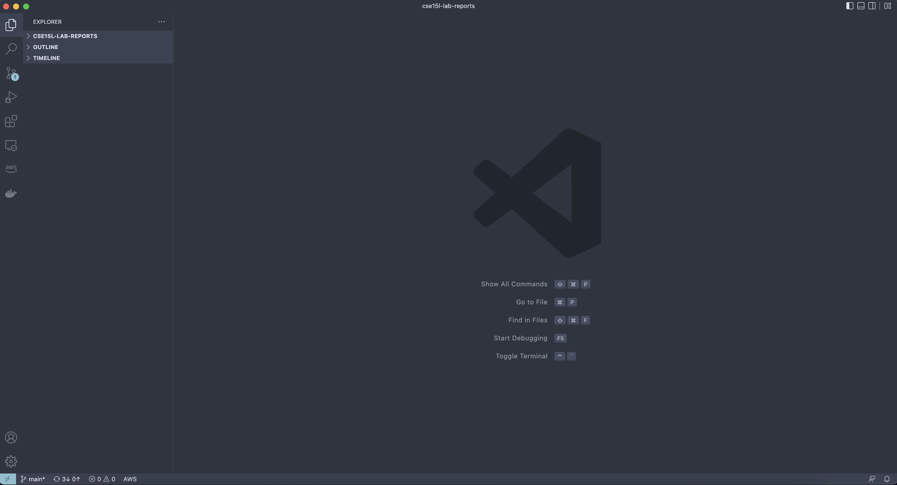

## Step 3: Remotely Connecting Through SSH

For the purposes of this demonstration, ssh is a command that we will use to remotely connect to a separate computer. On most Mac computers, this client has already been installed by the operating system, so there's nothing else to be done on your end. However, if you're using Windows you will need to install the OpenSSH client, which can be done [here]. On all operating systems you will just need to use the letters `ssh` to get access to the functionality.

Once you have the client, go to VS Code and open up a terminal. This can be done by either using the Terminal --> New Terminal option, or using the Ctrl/Cmd + ` shortcut. 

Once you're in the terminal try typing a command like this:

`$ ssh cs15lfa22dy@ieng6.ucsd.edu` (Keep in mind that it's a l after the 15 and not a 1; also, ignore the dollar sign as the only thing your computer will start to read is the ssh)

The dy will be replaced with what your course specific account username.

If it's your first time connecting remotely, you will receive a message that will say that the authenticity of the host you want to connect to hasn't been established yet. To bypass this, just type `yes` when asked if you want to continue connecting to the computer. 


`Password: `

For this, make sure you use the password you set earlier when finding your course specific account. 

If the password is correct, you should see some text like this in the terminal. 

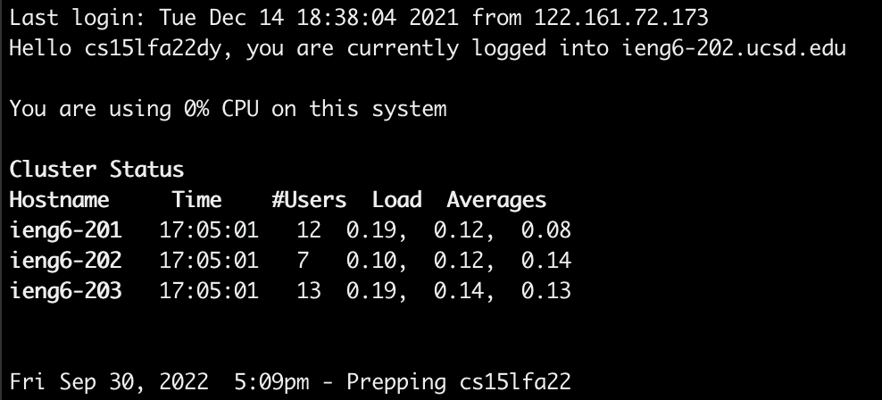

Good job! You have now established a secure connection to a remote computer. You'll see that you are assigned either 201, 202, or 203 for the computer's number. This is randomized.

## Step 4: Running Some Commands on the Remote Computer

Here are a few essential commands you can try to run in both on **your** computer, as well as the remote computer you connected to:

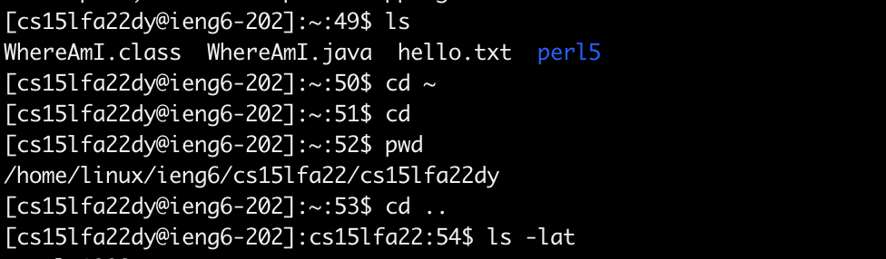
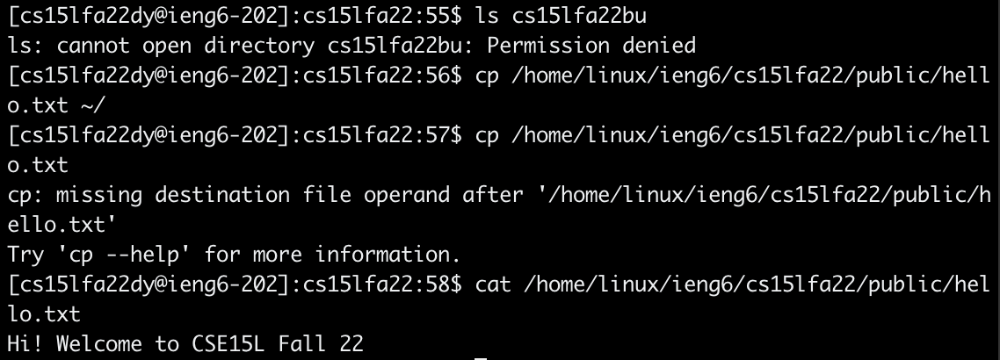

If you want to exit the ssh, simply type `exit`.

## Step 5: Moving Files with `scp`

Create file called WhereAmI on own computer with the following information:

```
class WhereAmI {
  public static void main(String[] args) {
    System.out.println(System.getProperty("os.name"));
    System.out.println(System.getProperty("user.name"));
    System.out.println(System.getProperty("user.home"));
    System.out.println(System.getProperty("user.dir"));
  }
}

```

Compile and run the code you just typed with javac and java, like in the example below.

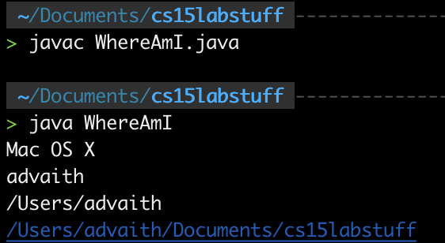

Then, run the following command(but with your username):

    `scp WhereAmI.java cs15lfa22dy@ieng6.ucsd.edu:~/`

Explanation:

1. `scp` stands for secure copy and allows us to provide two arguments
2. One argument is the file we want to move, in this case it is WhereAmI.java
3. The second argument is the location where we want to transfer it to. Here we want to move it to the ~/, or root directory of cs15lfa22dy@ieng6.edu and adding the `:`.

Here is what it should look like:

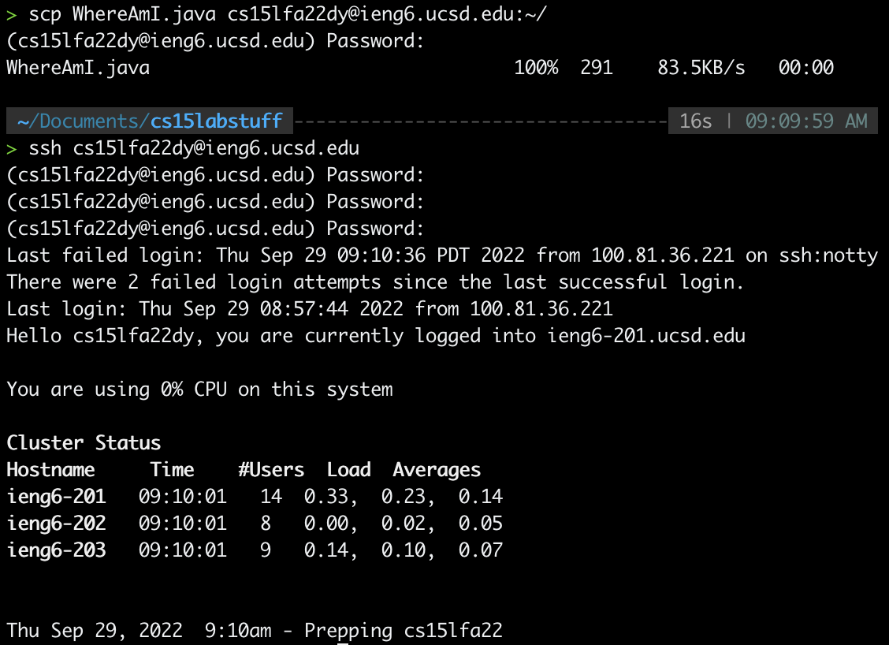
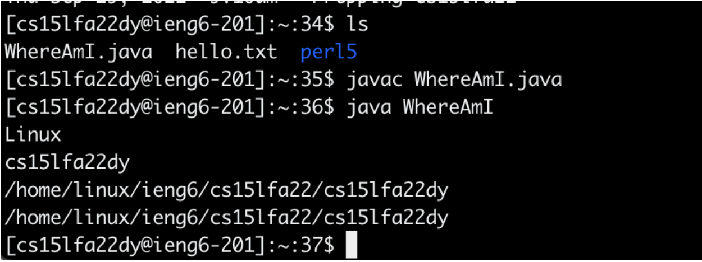

## SSH Keys

To simplify the process of always having to use a long password when moving files to the remote computer, we can utilize something known as a ssh key.

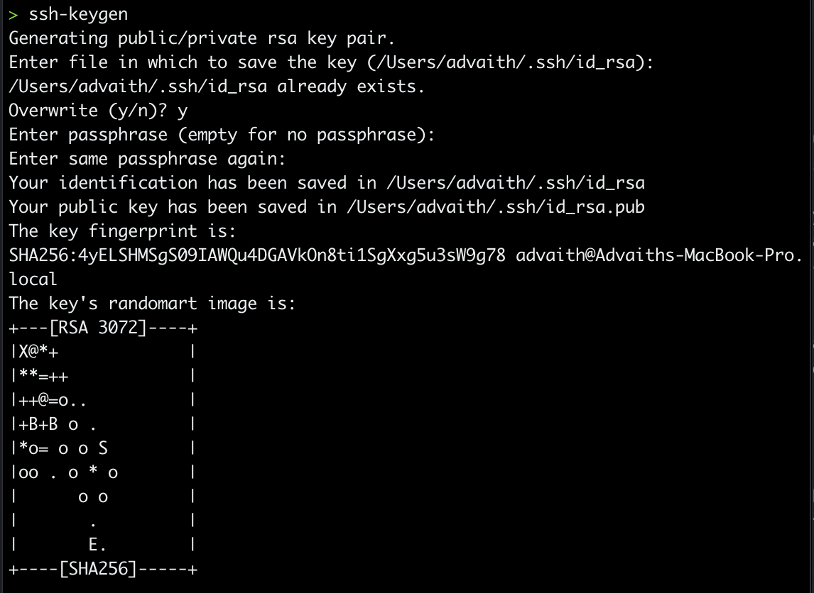

Type the commands as shown and whenever prompted for key, simply press enter. 

Steps to copy public key to server/remote account:

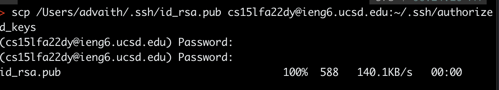

Here, I used scp to copy the folder that contains the .pub file with the key, which I got from the first image. The .pub file is moved to a file called authorized_keys in the .ssh directory of the remote computer, which I made using `mkdir .ssh` (For the purposes of the lab report, this didn't work because I had already created the directory during the lab itself).

Proof that it works (now there is no need to enter a password):

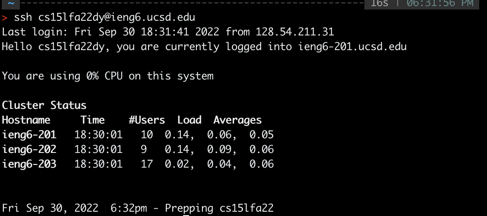

## Optimizing Remote Running

Simplifying the process of making local edits to files and copying it to remote server, then running.

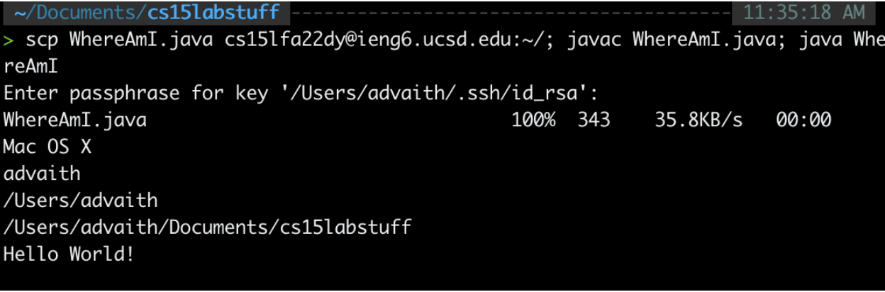

Ran multiple commands in the same line using shortcuts like `;` and clicking up arrow to use previously ran commands from terminal.


