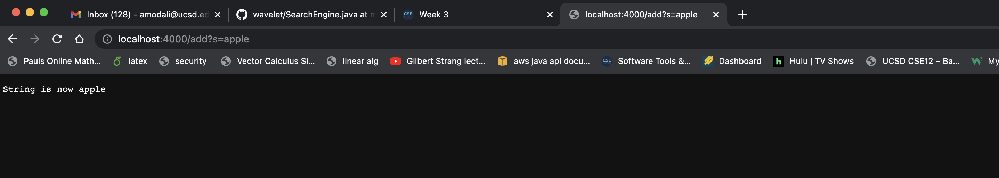
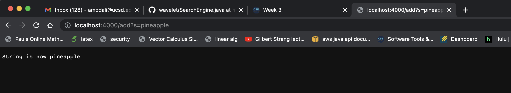
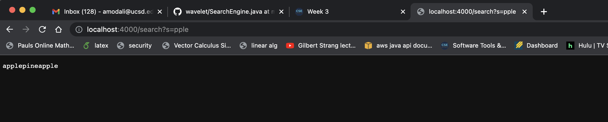
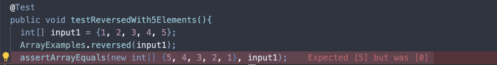
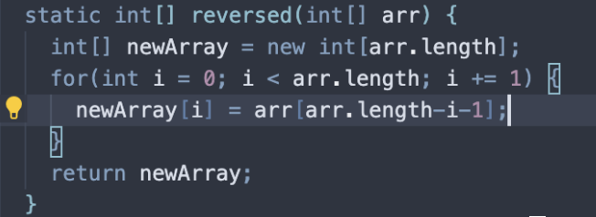
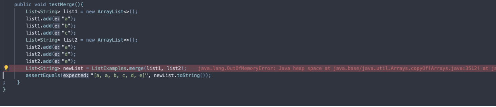
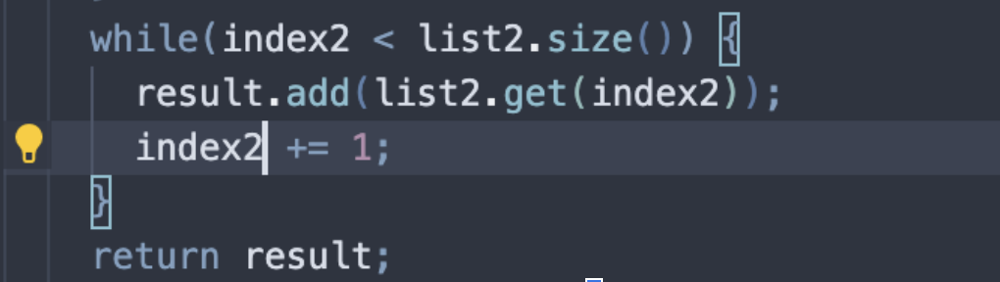

# Advaith Modali Lab Report 3 - Week 3

## Part 1 : Simplest Search Engine

```
# code for SearchEngine.java

import java.io.IOException;
import java.net.URI;
import java.util.ArrayList;


class Handler implements URLHandler {
    // The one bit of state on the server: a number that will be manipulated by
    // various requests.
    ArrayList<String> listOfStrings = new ArrayList<>();	
    public String handleRequest(URI url) {
        if (url.getPath().contains("/add")) {
            String[] parameters = url.getQuery().split("=");
            if (parameters[0].equals("s")) {
                listOfStrings.add(parameters[1]);
                return String.format("String is now %s", parameters[1]);
                }
            }
        if(url.getPath().contains("/search")){
            String result = "";
            String[] words = url.getQuery().split("=");
            if(words[0].equals("s")){
                for(String val: listOfStrings){
                    if(val.contains(words[1])){
                        result+=val;
                    }
                }
                return String.format(result);
            }
        }
            return "404 Not Found!";
        }
    }

class SearchEngine{
    public static void main(String[] args) throws IOException {
        if(args.length == 0){
            System.out.println("Missing port number! Try any number between 1024 to 49151");
            return;
        }

        int port = Integer.parseInt(args[0]);

        Server.start(port, new Handler());
    }
}
```



Here, the handleRequest method in `SearchEngine.java` is called. The appripriate url is everything we have, with the  `add?s=apple`. Since the if loop in the code sees that "add" is present in the url, it will create a string array called parameters and fill it with each element in the query that is separated with an equals sign. From here it will see that if the first element in the array is "s" the next item in the parameters array will be added to an arraylist called listOfStrings. Each time this occurs, the arraylist will be updated and whatever query we call using the `add` keyword will be added to it. Whichever word is present in the query after the equals sign will be printed to the screen. 




Similar to the last screenshot, the handleRequest method will be called here to. Following the same logic, we decide to pass an argument called pineapple into the query. This will cause the code to recognize that since the first element in the parameters array is "s" it will need to add whatever is after the equals sign to the array. This way, we will return that the string is now pineapple to the screen. 



Once again, the handleRequest method will be called in this scenario. However, since the check for the add keyword will fail, it will then go on to check is search is present, yielding true. We create a empty string called null in our code, as well as an array called words, similar to parameters, that adds all elements of the query split by the equals sign. Since the first element of that array is "s" we will iterate through the arraylist described above. Since it contains elements that were added from the two adds that we did before, it now contains the words apple and pineapple. Within the actual method, an if loop is created to check if any element in the arraylist contains the substring we added to the end of the query, which is in this case "pple". When the request is done processing, the empty string we created earlier now consists of both apple and pineapple, since they contain the substring we pass into the query. This is ultimately printed to the screen.

## Part 2: JUnit Testing & Bugs

**ArrayExamples.java**

Failure Inducing Input:


Symptom:
The symptom, or failure message I received from this test was that accoring to the actual implementation of the method, our test expected that the element in position 0 of the returned array was 5, but the implementation yielded that same position to be the number 0 instead. 

Bug(Code fix needed):

The bug was that within the reversed method, the array that was being returned was the original array passed as an argument, instead of the new array we created to hold the accurate values. 



The bug causes this particular symptom for this input because we failed to change the value that was being returned from this message. When testing, input1 is still the same and hasn't changed at all, so it will return an error since we are comparing it to a completely different array. When accurately fixing the test after editing the code we can initialize a new array that holds the return address of the method being implemented on an input. This will yield a test that passed. 

**ListExamples.java**

Failure Inducing Input:


Symptom:
The symptom from this test gave me the message that a memory error occured when trying to merge these lists. The test immediately encountered an error due to a bug that existed within the merge method itself. It appears as if the heap space was overloaded due to this bug in the code. 

Bug(Code fix needed):


Here we see that previously this while loop featured index1 being incremented continuously instead of index2. Index1 has no relation to this loop so it is wrong to have that incremented. 

The bug causes this particular symptom for this input because we are under the notion that for as long as index2 will be less than the size of the second list, we will add that value to result and increment index2 by one each time. By incrementing index1 by one, we aren't doing anything to index2 and therefore will encounter an infinite loop that leads to the heap space error we see above. To fix this, we just need to change index1 to index2 within the actual method. This will yield a passing test. 
