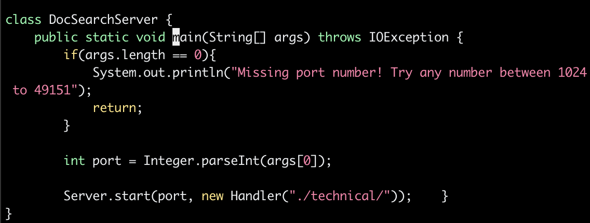
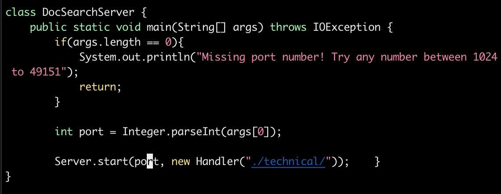
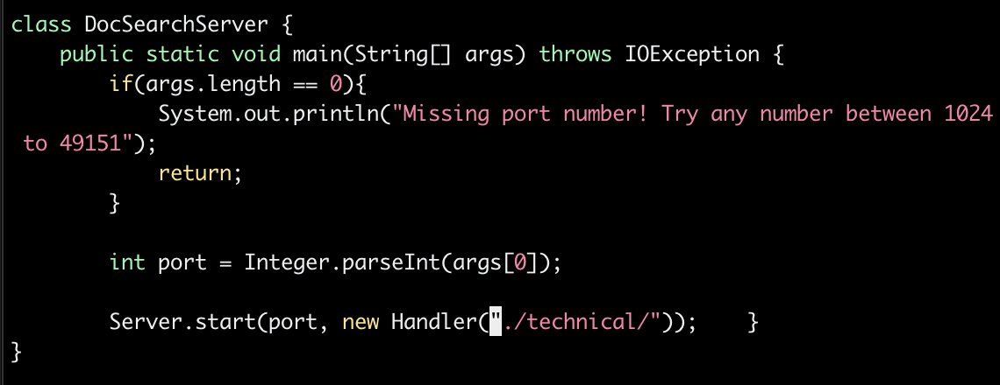
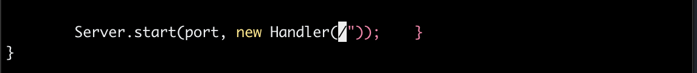
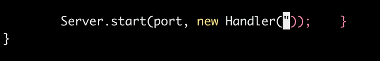
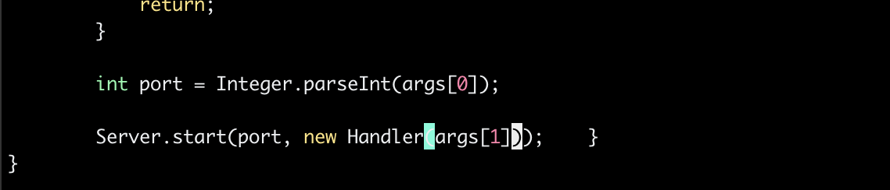

# Advaith Modali - Lab Report 4 Week 7 (Vim)

## Part 1

Task 3:
    
    Changing the main method to take a command-line argument

**Sequence**
1. `vim D<Tab><Enter>`
2. `/main<Enter>`



Here, we type `/main` to activate the search function for the word "main". We then click the enter key and since there is only one instance of the word "main," we are taken to that instance and the cursor is moved there.

3. Hold down `j` until you get to the line of the 'technical' argument


Here, we hold down the j key from the initial cursor starting point until we get to the line of the code where we create a handler object with the technical parameter.

4. Hold down `l` until you get to the quote marks surrounding the './technical/'


Here, we hold down the i key from the initial cursor placement on the same line to get the cursor to the point of the first quote mark where the argument is passed in.

5. `d2w`


Here, we type d2w in order to delte two "words". In this case, we are left with /".


6. `xx`


Here, we simply click the x key twice in order to delete the current letters the cursor is on, leaving nothing inside the parentheses.

7. `i`
8. `args[1]`


In this situation, I type args[1] where the cursor currently is to fill the argument with the goal of this task. 

9. ```<Esc> ```
10. ```:wq<Enter>```

## Part 2

Time took for first task: 60 seconds

Issues: had to perform copy multiple times in order to get the file to the right directory to run test.sh


Time took for second task: 30 seconds

If I had to work on a program that I were running remotely, the better option would be to perform the second task. This is purely based on the idea that it would save much time and not lead to additional issues such as copying files over to the wrong directory, a mistake that I had made in the first task. Moreover, the second task greatly reduces the error in having to worry about potential connection issues when transferring the files to the remote server. 

The primary detail that factored into my decision was the time it took to run the second task compared to the first. In addition, the general nature of the second task to be more smooth in terms of guaranteeing less machine issues makes it much more convenient to perform the task at hand. An additional feature that might factor into my decision is how complex the edit is and how long the edit takes. For simple logistic issues it could be more convenient to perform all edits on the remote server instead of taking time to do them on the local machine and then copying over + relying on speed to transfer to remote.


