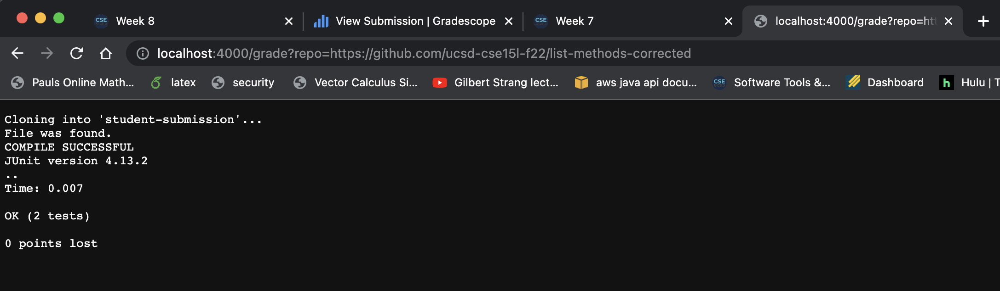
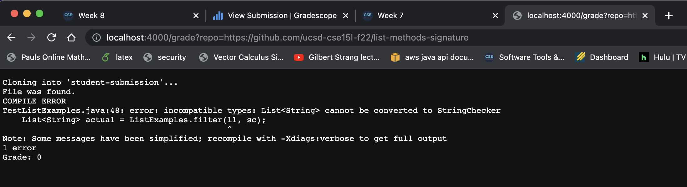
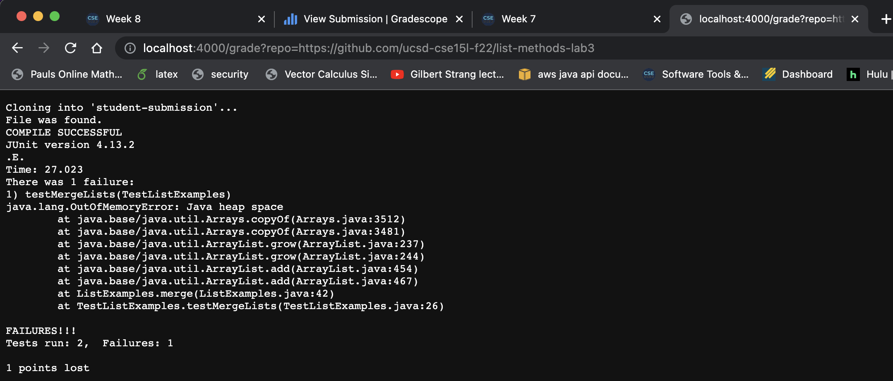

# Advaith Modali - Lab Report 5 Week 9 (Grade Script)

## Script Code

`grade.sh`

```
rm -rf student-submission

git clone $1 student-submission

cd student-submission/

if [[ -f "ListExamples.java" ]] 
then
    echo "File was found."
else 
    echo "FAIL"
    echo "File was not found in directory"
    echo "Grade: 0"
    exit
fi

cd ..

cp TestListExamples.java student-submission/

cd student-submission/
javac -cp .:/users/advaith/Documents/GitHub/list-examples-grader/lib/hamcrest-core-1.3.jar:/users/advaith/Documents/GitHub/list-examples-grader/lib/junit-4.13.2.jar *.java 2> error.txt

if [[ $? -eq 0 ]]
then
    echo "COMPILE SUCCESSFUL"
else
    echo "COMPILE ERROR"
    echo "$(cat error.txt)"
    echo "Grade: 0"
    exit
fi

java -cp .:/users/advaith/Documents/GitHub/list-examples-grader/lib/hamcrest-core-1.3.jar:/users/advaith/Documents/GitHub/list-examples-grader/lib/junit-4.13.2.jar org.junit.runner.JUnitCore TestListExamples > junit.txt

cat junit.txt

echo "$(grep -c "Failures:" junit.txt) points lost"

```

## Submission Screenshots

1. Submission for repository https://github.com/ucsd-cse15l-f22/list-methods-corrected




2. Submission for repository https://github.com/ucsd-cse15l-f22/list-methods-signature



3. Submission for repository https://github.com/ucsd-cse15l-f22/list-methods-lab3




## Script Tracing

We will be performing script tracing on the first submission for the repository with the link https://github.com/ucsd-cse15l-f22/list-methods-corrected.

Line By Line Analysis:

For this specific repository, the lines that don't run are the following:
```
else 
    echo "FAIL"
    echo "File was not found in directory"
    echo "Grade: 0"
    exit
else
    echo "COMPILE ERROR"
    echo "$(cat error.txt)"
    echo "Grade: 0"
    exit
```

Such lines do not run because for the provided repository, it passes every one of our checks and does not need to exit the script at any point due to this. 


Lines that do run: 

`rm -rf student-submission`

For this, the standard output and error are both empty because this command is known as 'silent.' What this means is that it performs its operation without yielding stdout and stderr. Its purpose is to remove by force a directory called student-submission, thereby deleting all of its contents and its presence in a file system as well. 

The return code would be 0 for this command. 

`git clone $1 student-submission`

For this, the return code was zero since for this specific repository, there were no errors in running the command. 


